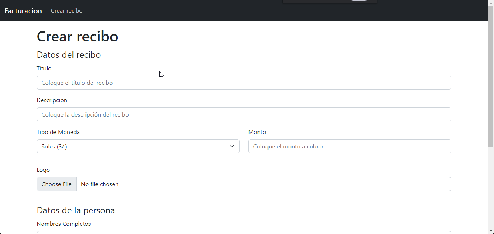
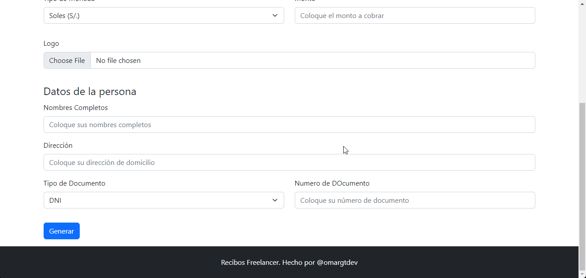
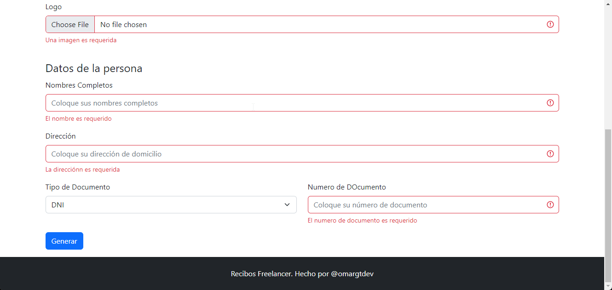
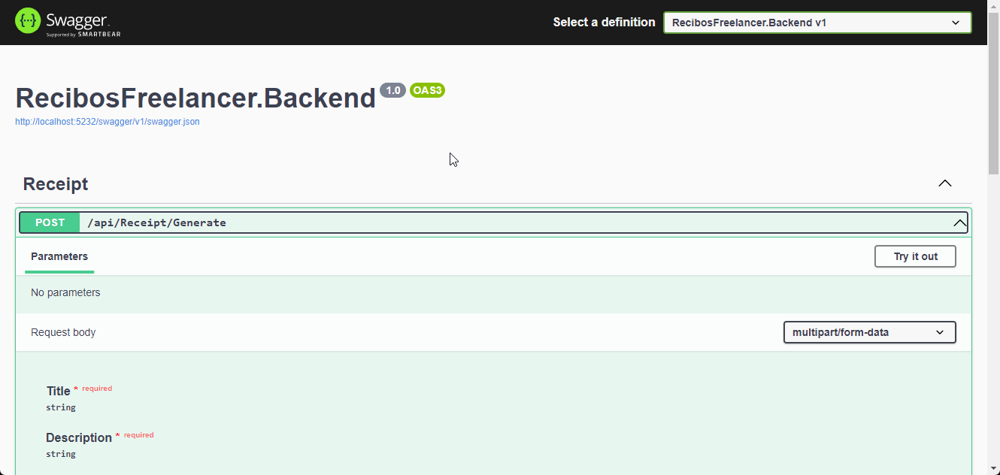
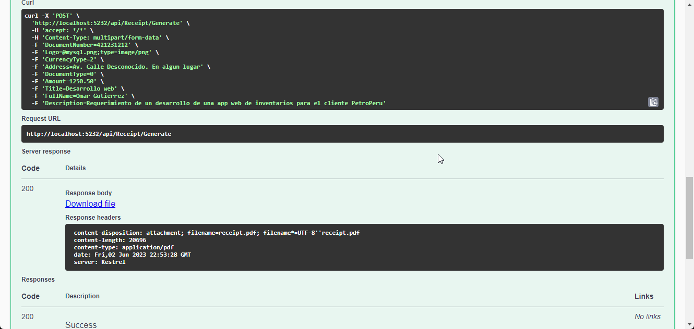
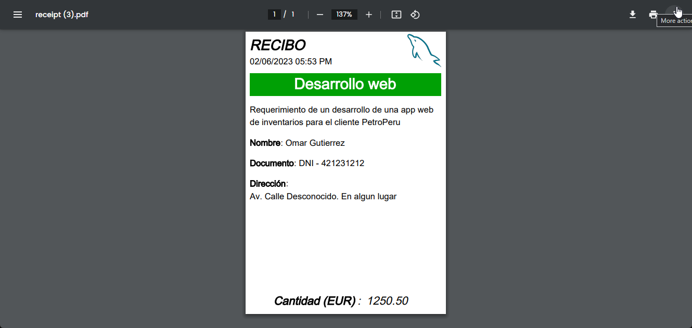
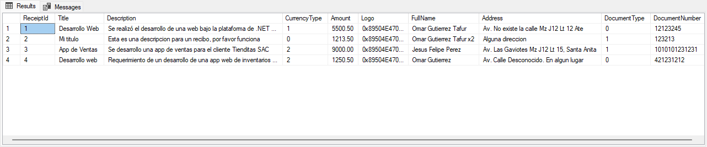

# Recibos para Freelancers

Plataforma para poder generar recibos orientado a freelancers hecho con React 18 (Frontend) y .NET 7 (Backend)
pudiendo registrar los recibos generados en una base de datos, en este caso, SQL Server (Version 2022).

## Preview 

### Front

### Backend

## ¿Cómo levantarla? (Para fines de desarrollo y pruebas)

### Prerrequisito
- Clonarse el repositorio
- Tener instalado node (la versión trabajada fue v18.16.0)
- Tener instalado el sdk de .NET (la versión trabajada fue .NET 7)
- Tener instalado SQL Server 2022

### Frontend
1. Dirigirse a la carpeta del frontend (RecibosFreelancer.Frontend)
2. Ejecutar `npm run dev` en una terminal
3. Dirigirse al navegador con la ruta que se le proporciona

### Backend
1. Dirigirse a la carpeta del backend (RecibosFreelancer.Backend)
2. Descargar el script *DB.sql* de la carpeta del backend, y ejecutarlo
2. Ejecutar `dotnet run` en una terminal

## Funcionalidades

### Crear recibo
El software web le permite generar recibos ingresando los datos que se necesita
en el formulario.

## TODO
- [x] Implementar una base de datos, para guardar los recibos generados como un historial (backend)
- [ ] Implementar una vista para visualizar el historial de recibos generados y poder descargarlos (frontend)
- [ ] Desplegarla en la nube, e.g Azure (deploy)
